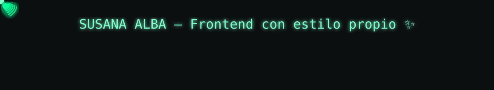

  

  <!-- Typing effect -->
  

---

## 🧰 Tech stack principal

  <!-- Lenguajes -->
  
  
  
  <!-- Frontend -->
  
  
  
  
  
  

  
  <!-- Backend -->
  
  
  
  <!-- DB -->
  
  

  

### 🛡️ Ciberseguridad

  <!-- Kali Linux -->
  
  <!-- Wireshark -->
  
  <!-- Splunk -->
  
  <!-- OWASP -->
  
  <!-- Nmap -->
  
  <!-- Metasploit (no oficial en SimpleIcons, usamos alternativa) -->
  
  <!-- OpenSSL -->
  
  <!-- Wi-Fi Hacking -->
  

---

## 🌐 Redes y contacto

  
  
  

---

---

## 🏆 Trofeos 

  <!-- Trofeos estilo Matrix -->
  

  <!-- Lenguajes más usados -->
  

## 🐍 Snake (contribuciones)
<!-- Asegúrate de tener el workflow que genera estos SVG en la rama 'output' -->
<picture>
  <source media="(prefers-color-scheme: dark)" srcset="https://raw.githubusercontent.com/SUALBA/SUALBA/output/github-contribution-grid-snake-dark.svg" />
  
</picture>

---

## 📊 Stats 

  

---

  <!-- Contador de visitas (verde Matrix) -->
  

